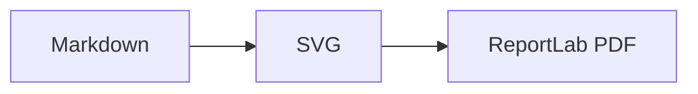

# mDpresent

mDpresent turns Markdown into a themed PDF. ReportLab lays out every page. Mermaid CLI renders diagrams to SVG, and `svglib` passes the SVG paths to ReportLab without rasterizing them.

## Set up

The commands below use the requested shared virtual environment and the project's local Mermaid runtime.

```bash
cd /home/lucasegp/mdpresent
/home/lucasegp/venv/bin/pip install -e '.[dev]'
PUPPETEER_SKIP_DOWNLOAD=1 npm install
```

Chrome or Chromium must be installed. The renderer finds `google-chrome`, `chromium`, or `chromium-browser`; `mermaid.chrome` can point to a different executable.

## Render a document

```bash
/home/lucasegp/venv/bin/mdpresent examples/features.md \
  --config examples/theme.yml \
  --output examples/output/features.pdf
```

Without `--output`, the PDF is written next to the Markdown file. Without `--config`, mDpresent uses the built-in theme.

An example branded theme is included:

```bash
mdpresent examples/features.md -c themes/icmc.yml -o features-icmc.pdf
```

The ICMC theme follows the supplied ICMC/USP identity manual.  See `themes/README.md` for the source details.

To make a complete editable theme file:

```bash
/home/lucasegp/venv/bin/mdpresent --write-default-config my-theme.yml
```

The default theme draws a small built-in mark. Set `header.logo` to a file path to replace it; relative paths resolve from the theme file. Raster logos keep their own brand colors. SVG logos can use `{{ logo_primary }}` and `{{ logo_secondary }}` placeholders so their colors follow the YAML theme.

## Markdown coverage

The renderer handles headings, emphasis, strong text, strikeout, links, inline code, fenced code with syntax color, local or remote images, block quotes, rules, footnotes, task lists, ordered and unordered nested lists, tables that repeat their header across pages, and explicit `<!-- pagebreak -->` markers.

A Mermaid fence stays vector in the PDF:

````markdown

````

Small diagrams stay in the text flow. Wide diagrams move to landscape pages. If fitting a diagram would shrink its labels below the configured threshold, mDpresent tiles it across overlapping pages. The relevant settings are `landscape_when_scale_below`, `split_when_scale_below`, `tile_scale`, and `tile_overlap_mm` under `mermaid`.
