# An intentionally overlong report title used to verify that the running header truncates cleanly

## A wide diagram that needs several readable pages

The diagram below is intentionally wider than a landscape page. The PDF should tile it with overlap instead of turning it into a blurry strip.

```mermaid
flowchart LR
    accTitle: End-to-end platform migration with review gates
    N01[01 Inventory services] --> N02[02 Classify dependencies]
    N02 --> N03[03 Assign owners]
    N03 --> N04[04 Capture baselines]
    N04 --> N05[05 Design target state]
    N05 --> N06[06 Review security model]
    N06 --> N07[07 Build shared tooling]
    N07 --> N08[08 Migrate pilot service]
    N08 --> N09[09 Measure the pilot]
    N09 --> N10[10 Fix migration gaps]
    N10 --> N11[11 Move data stores]
    N11 --> N12[12 Shift read traffic]
    N12 --> N13[13 Shift write traffic]
    N13 --> N14[14 Validate recovery]
    N14 --> N15[15 Retire old paths]
    N15 --> N16[16 Publish final report]
```

## Content after landscape pages

This paragraph must return to a portrait page after the tiled diagram.

| Key | Value |
|:--|:--|
| Empty cell follows | |
| Escaped characters | `A < B && B > C` |
| Unicode | São Paulo, naïve, Ελληνικά, 日本語 |

<!-- pagebreak -->

## Explicit page break

This section starts on a new portrait page.

