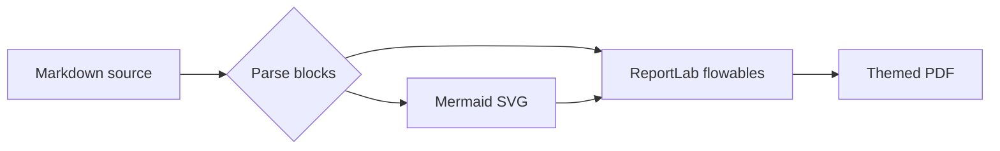

# A practical field guide to reliable document pipelines

This sample exercises ordinary Markdown and the awkward corners that tend to break PDF exporters. It includes **strong text**, *emphasis*, ~~obsolete wording~~, `inline_code()`, and a [working link](https://www.reportlab.com/).

## Lists with real nesting

- Prepare the source material.
  - Confirm the owner and revision date.
  - Check the diagrams.
    1. Keep labels short.
    2. Use a clear reading direction.
- Render the document.
  1. Apply the project theme.
  2. Inspect page breaks.
- [x] Preserve vector charts.
- [ ] Send the approved PDF.

1. Read the executive summary.
2. Review the evidence.
   1. Compare current and target behavior.
   2. Record exceptions.
3. Decide what changes next.

> Good pagination is quiet. Readers notice it only when a table loses its header, a list marker drifts away from its text, or a diagram becomes too small to read.

## Definitions and callouts

Render contract
: The source, theme, and assets needed to reproduce the same document.

Vector asset
: An SVG illustration or chart that remains sharp at any PDF zoom level.

!!! note "One source, several presentation layers"
    Extensions such as H~2~O and release^candidate^ annotations use native subscript and superscript markup. The same source can still be read as plain text.

## A labeled, linked image

[{#fig-report-pipeline width="82%"}](https://www.reportlab.com/)

The standard image title becomes the visible label. Optional attributes can add an anchor and set `width`, `height`, or an explicit `label`.

## A table with alignment and wrapping

| Area | Current behavior | Target | Owner | Status |
|:--|:--|--:|:--:|:--|
| Source | Markdown stored with the project | One reviewed source of truth | Docs | Ready |
| Charts | Screenshots pasted at mixed resolutions | SVG paths embedded in the PDF | Platform | In progress |
| Theme | Colors copied between scripts | One YAML file with every renderer color | Design | Ready |
| Release | Manual file naming | Deterministic output path and metadata | Ops | Planned |

## Code and long lines

```python
from pathlib import Path

def output_path(source: Path) -> Path:
    """Keep the generated file beside its source."""
    return source.with_suffix(".pdf")

print(output_path(Path("notes/review.md")))
```

The renderer wraps prose with a long unbroken token instead of overflowing the frame: `release_candidate_identifier_2026_08_25_with_a_deliberately_long_suffix_that_should_stay_inside_the_page`.

## A compact vector diagram



## Notes and references

Footnotes stay with the document rather than disappearing during conversion.[^layout]

[^layout]: ReportLab's Platypus engine handles flowing content and repeated table headers.

---

### Final check

The running header uses two fields of color, an accent rail, the configured logo, a shortened title when space is tight, and the page number.
